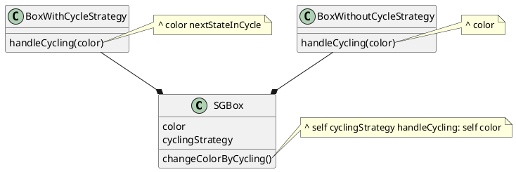
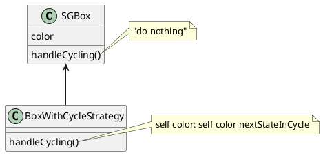

```plantuml
@startuml

class SGBox {
color
cyclingStrategy

changeColorByCycling()
}

note right of SGBox::changeColorByCycling
^ self cyclingStrategy handleCycling: self color
end note


class BoxWithCycleStrategy {
 handleCycling(color)
}

BoxWithCycleStrategy --* SGBox

note right of BoxWithCycleStrategy::handleCycling
^ color nextStateInCycle
end note


class BoxWithoutCycleStrategy {
 handleCycling(color)
}

BoxWithoutCycleStrategy --* SGBox

note right of BoxWithoutCycleStrategy::handleCycling
^ color
end note


@enduml
```

```plantuml
@startuml

class SGBox {
color

handleCycling()
}

note right of SGBox::handleCycling
"do nothing"
end note


class BoxWithCycleStrategy {
 handleCycling()
}

SGBox <-- BoxWithCycleStrategy

note right of BoxWithCycleStrategy::handleCycling
self color: self color nextStateInCycle
end note


@enduml
```
