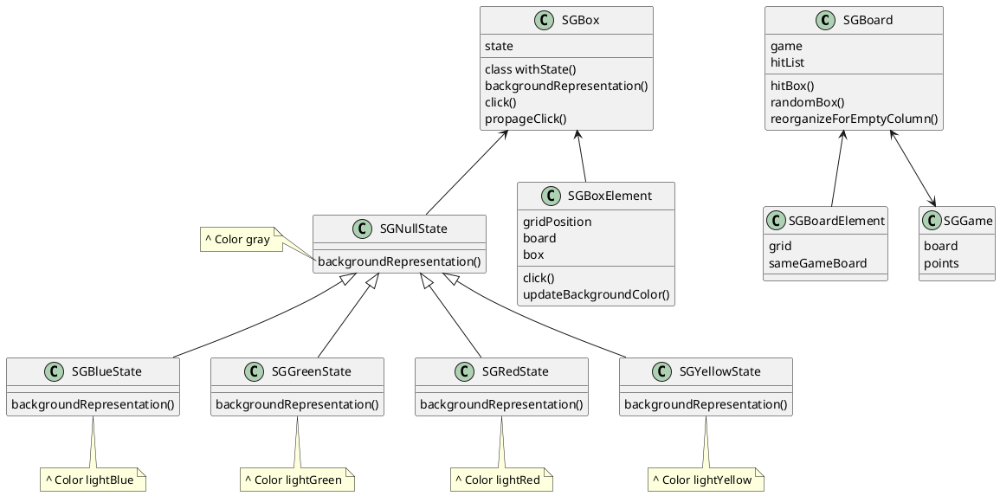
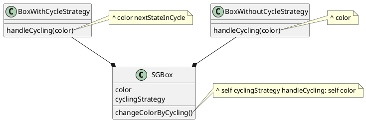
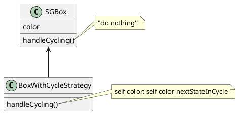

```plantuml
@startuml
class SGBoard {
game
hitList
hitBox()
randomBox()
reorganizeForEmptyColumn()
}
class SGBlueState {
backgroundRepresentation()
}
class SGBoardElement {
grid
sameGameBoard
}
class SGBox {
state
class withState()
backgroundRepresentation()
click()
propageClick()
}
class SGGame {
board
points
}
class SGGreenState {
backgroundRepresentation()
}
class SGNullState {
backgroundRepresentation()
}
class SGBoxElement {
gridPosition
board
box
click()
updateBackgroundColor()
}
class SGRedState {
backgroundRepresentation()
}
class SGYellowState {
backgroundRepresentation()
}

SGNullState <|-- SGBlueState
SGNullState <|-- SGGreenState
SGNullState <|-- SGRedState
SGNullState <|-- SGYellowState

SGBoard <--> SGGame

SGBoard <-- SGBoardElement

SGBox <-- SGNullState

SGBox <-- SGBoxElement

note left of SGNullState::backgroundRepresentation
^ Color gray
end note

class SGBlueState
note bottom: ^ Color lightBlue
class SGRedState
note bottom: ^ Color lightRed
class SGGreenState
note bottom: ^ Color lightGreen
class SGYellowState
note bottom: ^ Color lightYellow

@enduml
```

```plantuml
@startuml

class SGBox {
color
cyclingStrategy

changeColorByCycling()
}

note right of SGBox::changeColorByCycling
^ self cyclingStrategy handleCycling: self color
end note


class BoxWithCycleStrategy {
 handleCycling(color)
}

BoxWithCycleStrategy --* SGBox

note right of BoxWithCycleStrategy::handleCycling
^ color nextStateInCycle
end note


class BoxWithoutCycleStrategy {
 handleCycling(color)
}

BoxWithoutCycleStrategy --* SGBox

note right of BoxWithoutCycleStrategy::handleCycling
^ color
end note


@enduml
```

```plantuml
@startuml

class SGBox {
color

handleCycling()
}

note right of SGBox::handleCycling
"do nothing"
end note


class BoxWithCycleStrategy {
 handleCycling()
}

SGBox <-- BoxWithCycleStrategy

note right of BoxWithCycleStrategy::handleCycling
self color: self color nextStateInCycle
end note


@enduml
```
