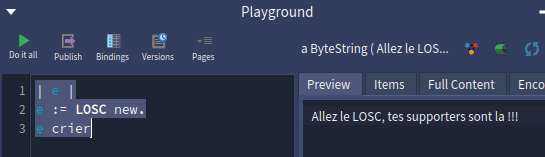
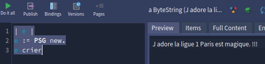

# DEVINCK Thomas


## 1) Practice message dispatch

### _Write small code examples challenging your knowledge about dispatch. Did the examples work as expected? What was different between what you expected and what you saw in reality? How can you correct your assumptions and how did you find this information? Share your programs in the report with the answer to those questions._

Cette semaine j'ai effectué le tp Dice avec les deux classes Die et DieHandle,ce tp ma permit de me former un peu plus à Pharo, de pratiquer le dispatch, de manipuler des collections ...

Voici le lien de mon exercice fini : 
- https://github.com/thomasdvck/C3P_Dice/tree/main

Ensuite j'ai commencer par re voir les vidéos pour être sur d'assimiler toutes les notions vu lors de la deuxiême séance.

Puis je me suis simuler un petit exercice avec l'utilisation de super et self pour distinguer les comportements de chacun.

J'ai simuler un exercice avec une classe parente et deux sous classes qui utilisent les mêmes méthode mais une sous classe qui utilise super et l'autre qui utilise self pour comprendre le dispatch avec self et super.


voici les méthodes dans Equipe :

```
Equipe >> nom: unNom
    nom := unNom.

Equipe >> crier
    ^ self supporter , ' !!!'.

Equipe >> supporter
    ^ 'J adore la ligue 1'
```

dans LOSC :

```
LOSC >> supporter
    ^ ' Allez le LOSC, tes supporters sont la'

```

dans PSG :

```
PSG >> supporter
    ^ super supporter , ' Paris est magique.'
```
j'ai commencer par faire `Losc new crier` et ai obtenu le résultat penser : 



Crier est défini dans Equipe mais utilise self supporter. Comme l'objet courant est Losc pharo choisit Losc >> supporter.

Puis j'ai effectuer `PSG new crier` et j'ai otenu également le résultat que je penser :



PSG >> supporter appelle super supporter donc pharo va chercher Equipe >> supporter ('Jadore la ligue1') puis ajoute sa phrase 'Paris est magique.' et ensuite crier rajoute les !!!

Cet exercice m'a permis de confirmer ce que je pensais de la différence entre self et super dans le mécanisme de dispatch en Pharo. Avec self, l'envoi de message apelle la méthode correspondant à la classe réelle de l'objet. Avec super la recherche de méthode reprend dans la superclasse.


# Delisle Baptiste 


Grâce au MOOC et aux expérimentations en Pharo, j’ai compris que le dispatch permet d’éviter les structures conditionnelles répétitives (par ex. des if ou case coûteux).
Un message est un choix dynamique : l’implémentation appelée dépend de 
la classe de l’objet au moment de l’exécution.

Si une classe SousClasse hérite d’une SuperClasse, alors l’envoi d’un message doSomething utilisera la méthode définie dans SousClasse si elle existe, sinon celle de SuperClasse.

Le dispatch dynamique en Pharo correspond à ce qu’on appelle le polymorphisme dans d’autres langages comme Java. Cela apporte :
    - une forte modularité,
    - des classes plus simples et mieux spécialisées,
    - la possibilité de faire évoluer le code sans changer les parties qui envoient les messages.

Pour tester le dispatch, j’ai créé un petit hiérarchie de classes :
    - Forme 
        - Cercle
        - Carre

    Forme >> aire
    ^ 0.

    Cercle >> initialize
    rayon := 1.

    Cercle >> aire
    ^ Float pi * (rayon squared).

    Carre >> initialize
    cote := 2.

    Carre >> aire
    ^ cote squared.

    Ensuite, j'ai écrit le test suivant : 
    | formes |
    formes := { Cercle new. Carre new. Forme new }.
    formes do: [:f | Transcript show: f class name, ' aire = ', (f aire) printString; cr ].

    Résultat attendu
    Je m’attendais à ce que :
        - Cercle new aire donne 3.14159... (π × 1²),
        - Carre new aire donne 4,
        - Forme new aire donne 0.

    En testant j'ai observé que ce sont bien les résulats que j'ai obtenu

