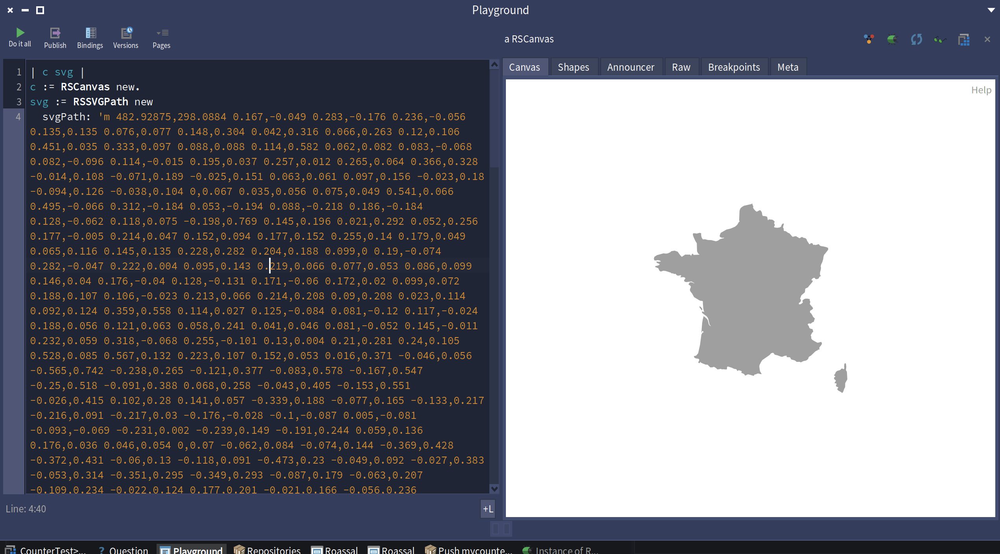
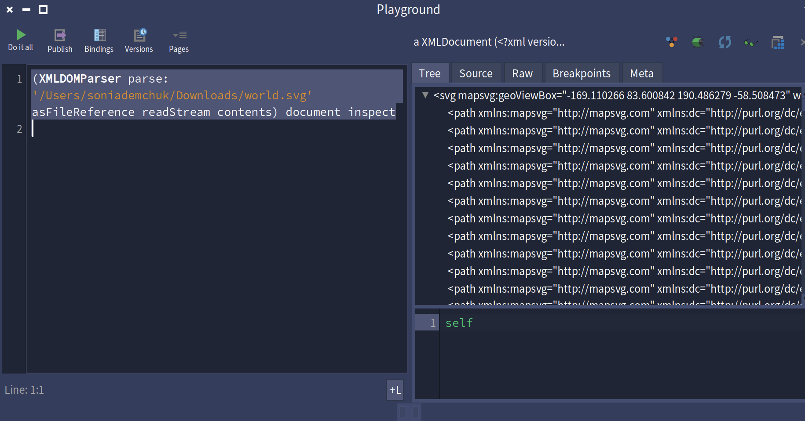
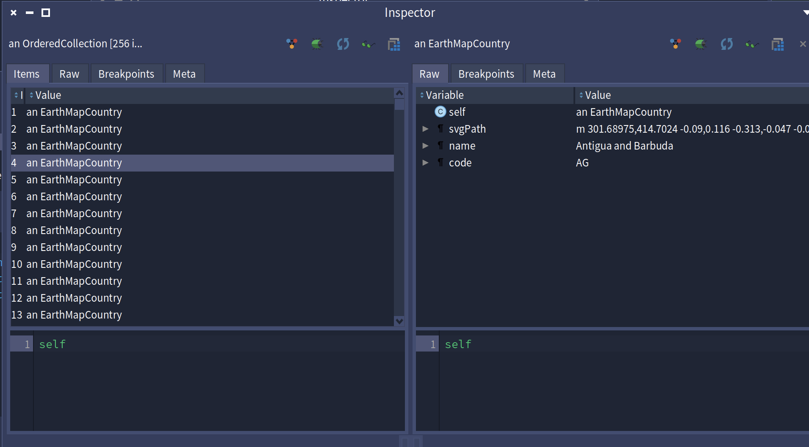

Report 2

Yuliia LOS:

I wrote a few tiny Pharo code examples to test how message dispatch works: how an object picks which method to run when I send a message, what “self” and “super” do, what happens when classes have inheritance, etc.

Examples and results

1. Simple inheritance & dispatch

Object subclass: #Animal
    instanceVariableNames: ''
    classVariableNames: ''
    poolDictionaries: ''
    category: 'Test'.

Animal >> speak
    ^ 'generic sound'.

Object subclass: #Dog
    instanceVariableNames: ''
    classVariableNames: ''
    poolDictionaries: ''
    category: 'Test'.

Dog >> speak
    ^ 'woof!'.

| a d |
a := Animal new.
d := Dog new.
Transcript show: a speak; cr.  "=> generic sound"
Transcript show: d speak; cr.  "=> woof!"

Dispatch is working: at runtime, Pharo looks up the class of the receiver (Animal vs Dog), finds the best method there or up in superclasses.

2. Using super keyword

Dog >> speak
    ^ super speak , ' and woof!'

The result is "generic sound and woof!"

3. What about missing method

| d |
d := Dog new.
Transcript show: d eat; cr.

I got a MessageNotUnderstood exception. Pharo says the message is not found, so dispatch fails.

Summary what I learned:

- message dispatch: when you send a message like object messageName, Pharo looks in the class of the object, if method is there uses it; if not, looks up in superclass chain.

- super changes where lookup starts (from superclass rather than current class).

- if no class in the chain has the method, a runtime error happens.

- this behaviour is dynamic: the actual class of the receiver (at runtime) matters, so polymorphism works (different subclasses respond differently).

I read the MOOC material about Module 1: Understanding messages — especially lectures about lookup, self vs super.

# Weekly Report2  Sofia Demchuk

This week I worked on two main parts: the **Flags exercise** (drawing countries, parsing SVG, and connecting to flags) and the **OOP practice** (Boolean operators, dispatch, and `super`).  

---

## Part 1: Flags and Maps

At the beginning, I followed the tutorial to display shapes from the `world.svg` file.  

- First, I copied one `path` definition (France) directly into a `RSSVGPath` object. It was surprising how just pasting the coordinates already produced a recognizable map in the Roassal canvas. That was my first step .
- 

- Then I learned how to parse the entire `world.svg` using `XMLDOMParser`. At first it looked messy - a huge tree of XML nodes, but in the inspector I realized the `nodes` field contained all the `<path>` elements for the countries.
- 

- After that, I created a new class `EarthMapCountry` with slots for `svgPath`, `name`, and `code`. I defined methods like `fromXML:` to build one country from an XML element, and `asRSShape` to turn it back into a Roassal shape. This was my first experience turning raw XML into real domain objects.  
- 
- When I inspected an instance, I could actually see the country name and code.

- Finally, I collected all the countries into an `OrderedCollection`.

**What I learned here:**
- How to connect **visualization** (Roassal) with **data parsing** (XML).  
- How to design small domain classes (`EarthMapCountry`) with clear slots and methods.  
- How to enhance the inspector so it doesn’t just show objects, but also their shape and name.  

## Part 2: Boolean operators

I also practiced implementing Boolean methods. The key point was to distinguish between **eager** and **lazy** evaluation.  

```smalltalk
False >> or: aBlock
    ^ aBlock value
```
When I tested:
```smalltalk
true | (Transcript show: 'eager'; cr. false).
true or: [ Transcript show: 'lazy'; cr. false ].
```
I saw the difference: the first printed even when unnecessary, the second skipped it.
So, in Smalltalk the argument of a normal message is always evaluated, unless we pass a block which makes it lazy.

## Part 3: Message dispatch and super
I wrote a small hierarchy (A → B → C) and overrode methods with super calls.
```smalltalk
C >> foo
   ^ 'C>>foo -> ', (super foo)
```
When running C new foo, the result was:
```smalltalk
C>>foo -> B>>foo -> A>>foo
```
At first I thought super might change the receiver, but actually the receiver stayed the same - still an instance of C. What changed was only the starting point for lookup. I confirmed this by printing self class inside the methods — it was always C.
This exercise helped me understand that message dispatch depends on the class where the method is defined, not on the runtime type of the receiver, when using super.

Another experiment: self == super. I learned that this is invalid syntax, because super is not a value, just a pseudo-variable for lookup. But conceptually it would always compare equal, since the receiver never changes.
