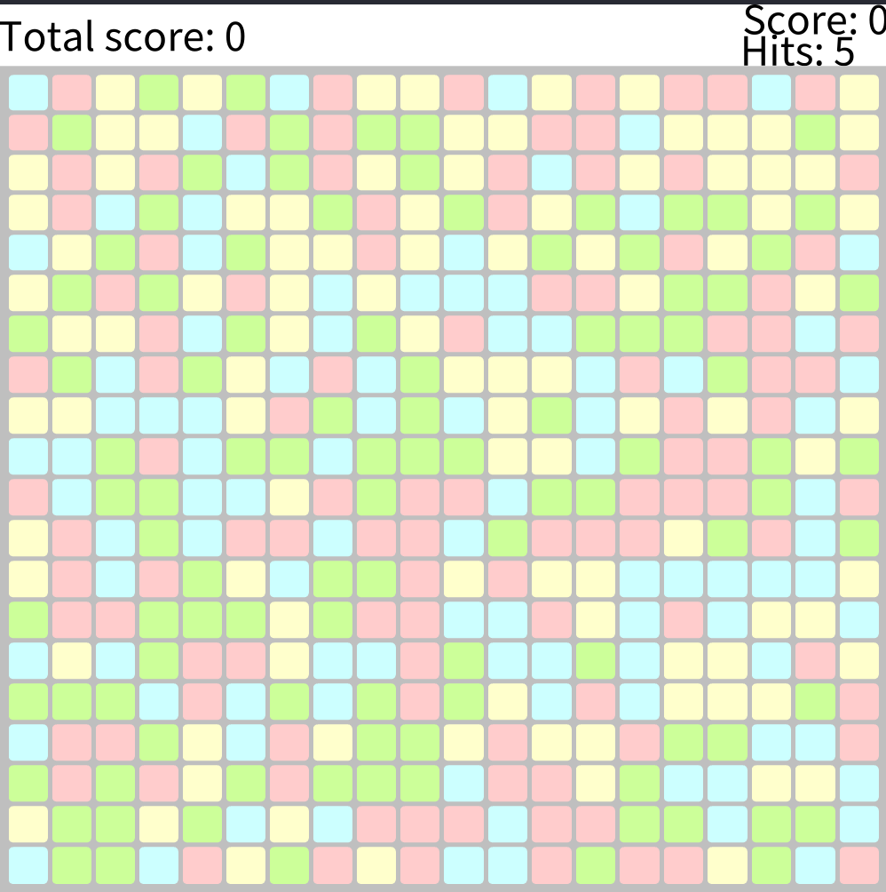

## Myg: SameGame Challenges

### Link to the repository
https://github.com/LeoDefossez/Myg

### What are the objectives ?
**Originals challenges**
- Display the number of killed tiles. 
- MultiColor. Introduce a kind of tile that matches all the surrounding colors.
- Cycling colors. The tile will change its color in a circle (red -> blue -> yellow -> red) after each action.
- Kill the line. Introduce a kind of tile that when clicked, it should eliminate the line.
- Kill the column. Introduce a kind of tile that when clicked, it should eliminate the column.

**Our own challenges**
- [Make different grid size](#ajout-dune-customization-de-la-taille-du-plateau)
- [Score for game](#Score-for-game)
- [Create other strategies of game initialisation](#Create-other-strategies-of-game-initialisation)
- [Create other strategies of points calculations](#Create-other-strategies-of-points-calculations)
- [Add a "bomb box" that destroy the 8 tiles around itself](#Add-a-bomb-box-that-destroy-the-8-tiles-around-itself)
- Add a stop condition on the game (make an announcement)
- Make skins to change appearances
- Making a serialisation/deserialisation for games, and offer the possibility to replay new games
- Saving a board and replaying it (Different strategies of game generation)
- History of moves and time travel
- A leaderboard of scores
- New game mode:
  - infinite blocs
    - limited number of moves
    - Limited time
- highlight chain of blocs when cursor is on it (Like a mode)
- Add a type of box that give more points
- make grayed UI for some moves, so that the user has to remember the board
- Make a rarity for blocs, and the rarity modify the scores

### Ce que l'on a fait
> Durant tout le projet, on a décidé d'ajouter nos feature sur des branches, et de créer un pull request pas feature.  
> C'est pourquoi Chacun des liens que nous fournissons est un lien vers une pull request, ce qui permet de comprendre facilement comment chacune des feature a été ajoutée.

#### Refactoring des null states
**Auteur : Léo Defossez**  
> https://github.com/LeoDefossez/Myg/pull/3
> https://github.com/Ducasse/Myg/pull/37
> In SameGame, all states inherited from a null state.
> It means that technically, every state is a null state.
>
> I propose another hierarchy, with an abstract state as the parent of every other states (Included the null state)

#### Ajout d'une customization de la taille du plateau
**Auteur : Xavier Moyon**  
https://github.com/LeoDefossez/Myg/pull/1  
// TODO

#### Score for game
**Auteur : Léo Defossez**  
> https://github.com/LeoDefossez/Myg/pull/6  
> Ajout d’une barre au-dessus du jeu décrivant le score total à gauche et le score du dernier coup à droite.
> Ce comportement est donc ajouté par la classe `SGScoreElement`.
>
> Il est actuellement prévu d’afficher également le nombre de blocs cassés lors du dernier coup (aussi à droite), mais un problème de conception dans le jeu m’empêche d’ajouter cette fonctionnalité simplement pour l’instant.
> L’issue suivante décrit ce problème : https://github.com/LeoDefossez/Myg/issues/4
>
> `SGScoreElement` est mis à jour à l’aide d’un announcer qui s’active lorsque le score change, de la même façon que l’interface des box est mise à jour lorsque leur état change.
>
> Voici la nouvelle fenêtre de jeu  
> 
>
> J’introduis également quelques refactorings pour nettoyer le code :
> - `SGBoard >> hitBoxOnx: x y: y` dupliquait le code de `SGBoard >> hitBox: aBox`. J’ai donc modifié la méthode `hitBoxOnx:y:` pour qu’elle utilise `hitBox:`.
> - `SameGame class >> gameWithSize:` size n’ouvre plus de fenêtre pour lancer le jeu, mais renvoie simplement une instance de `SGGame`, ce qui facilite le debugging.
>

#### Create other strategies of game initialisation
**Auteur : Gautier Louvier**  
//TODO

#### Create other strategies of points calculations
**Auteur : Gautier Louvier**  
//TODO

#### Add a "bomb box" that destroy the 8 tiles around itself
**Auteur : Xavier Moyon**  
// TODO