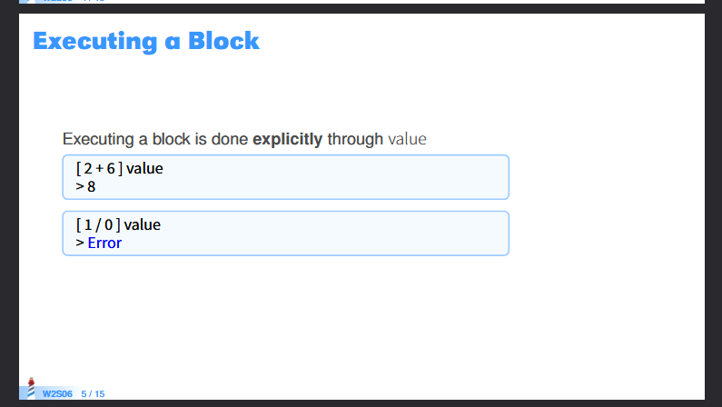
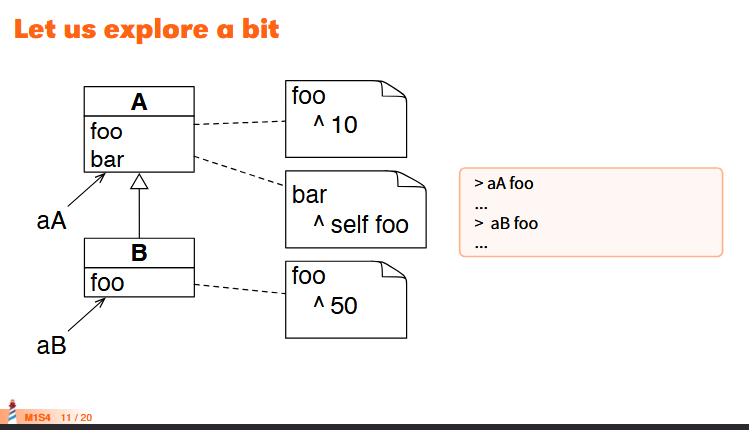

# Week 2 report

## Léo Defossez

### Think about how to implement the boolean methods `|`, `or:`, `ifTrue:ifFalse:`.

> Les trois méthodes sont basées sur le dispatch.  
> Ces implémentations suivent le principe OOP suivant : **Tell, Don't-Ask**. Ce principe utilise la liaison tardive pour réduire le nombre de conditionnels.
> #### `|`
> ```
> Boolean << | aBoolean
>   self subClassResponsibility
> 
> 
> True << | aBoolean
>   ^ self
> 
> 
> False << | aBoolean
>   ^ aBoolean
> ```
> 
>  #### `or:`
> ```
> Boolean << or: aBlock
>   self subClassResponsibility
> 
> 
> True << or: aBlock
>   ^ self
> 
> 
> False << or: aBlock
>   ^ aBlock value
> ```
> 
> #### `ifTrue:ifFalse:`
> ```
> Boolean << ifTrue: aBlock ifFalse: anotherBlock
>   self subClassResponsibility
> 
> 
> True << ifTrue: aBlock ifFalse: anotherBlock
>   ^ aBlock value
> 
> 
> False << ifTrue: aBlock ifFalse: anotherBlock
>   ^ anotherBlock value
> ```

### Lookup exercice

> Les deux définitions suivantes résument `super`, en comprenant celles-ci, il est simple de comprendre les exercices 
> - super refers to the receiver of the message (just like self)
> - The method lookup starts in the superclass of the class containing the super
expression

### `self == super` 
> Cette instruction sera toujours évaluée à true car super fait référence au receveur du message, comme le fait self

### Exercices
> Les deux exercices (DSL et Flags.pdf) sont présents sur ce dépot github : https://github.com/LeoDefossez/C3P_projects
>
### Question
> J'ai essayé d'ajouter le svg au presenter EarthCountryBrowser, en ajoutant de la même façon que l'image, mais en utilisant un presenter instantié par self newRoassal.  
> Voici les 4 méthodes impactées par ce changement. 
> ```
> EarthCountryBrowser << defaultLayout
>
>	^ SpBoxLayout newTopToBottom
>		  add: (SpBoxLayout newLeftToRight
>				   add: countryList expand: true;
>				   add: countryCode width: 40)
>		  height: self class toolbarHeight;
>		  add: countryFlag height: 350;
>		  add: countrySvg height: 350;
>		  yourself
> ```
> ```
> EarthCountryBrowser << initializePresenters
> ...
> countryFlag := self newImage.
> countrySvg := self newRoassal
> ```
> ```
> EarthCountryBrowser << onCountrySelected: countryItem
>
>	countryCode text: ' ' , countryItem code.
>
>	countryFlag image: (self flagForCountryCode: countryItem code).
>	countrySvg canvas: (self canvaForSvg: countryItem svgPath)
> ```
> ```
> EarthCountryBrowser << canvaForSvg: aSvgPath
>	| c svg |
>	c := RSCanvas new.
>	svg := RSSVGPath new
>		       color: Color blue;
>		       svgPath: aSvgPath.
>	c add: svg.
>	c @ RSCanvasController.
>	^ c   
>```
> En suivant le debugger, j'ai pu comprendre que la génération du canvas et du SpRoassalPresenter ne présentais pas de problèmes.  
> Cependant après plus d'une heure à essayer de comprendre quel était le problème sans trouver de solutions, j'ai décidé d'abandonner et poser la question suivante :
> Pourquoi le SpRoassalPresenter n'affiche rien alors que le RSCanvas semble correctement généré ?


## Xavier Moyon

### Think about how to implement the boolean methods `|`, `or:`, `ifTrue:ifFalse:`.

#### `|`

Pour le cas suivant si '|' est appelé sur True alors le résultat sera forcément True.
Cependant si '|' est appelé sur False alors le résultat sera ce qui est envoyé, soit True soit False. 
La table logique ci-dessous illustre bien ce principe : 

| OR        | **True** | **False** |
|-----------|----------|-----------|
| **True**  | True     | True      |
| **False** | True     | False     |

```pharo
True << |: aBoolean
^ self

False << |: aBoolean
^ anotherValue
```

#### `or:`

Etant donné que l'on va passer un block au receveur, il faudra l'éxécuter en utilisaant le message value dessus.


```pharo
True << or: anotherBlock
^ False new

False << or: anotherBlock
^ anotherBlock value

```

#### `ifTrue:ifFalse:`
```pharo
True << ifTrue: execution
^ execution 

True << ifFalse: execution
^ False new
// Dans ce cas ifFalse est faux donc on retourne faux

False << ifTrue: execution
^ self
// Dans ce cas ifTrue est faux donc on retourne faux

False << ifFalse: execution
^ 
```

### Lookup exercice

Do a pass on the lookup exercises from the slides. Do you get the correct result? Do you understand why? Try arriving until the cases with super sends.



Dans ce cas : 

- Pour aA foo : la méthode est présente dans la classe et retourne 10 donc aA foo renvoi 10
- Pour aB foo : la méthode est présente dans la classe et retourne 50 donc aB foo renvoi 50

- Pour aA bar : la méthode est présente dans la classe et retourne self foo.
self de foo fais appel à la méthode foo de la classe courante recevant le message (A, self fais référence à A sans décaler le Look up)
donc aA bar renvoi 10.

- Pour aB bar : la méthode n'est pas présente dans la classe, on décale donc le lookup vers la classe mère jusqu'à trouver la méthode bar. La classe A a ce message, on y fera donc appel .
On utilise donc le message bar de la classe A, cela appel self foo, dans ce cas self référence la classe B (classe courante du receveur) sans déplacer le look up, on fera donc appel à foo de la classe B qui renvoi 50
Donc aB bar = 50
### `self == super`

self et super font tout les deux référence au même Objet, il serait donc cohérent que self == super. La seule différence entre self et super est le fait que super va décaler le lookup vers la méthode mère.

### Exercices


### Question

Comment fonctionne self et super concretement, serait-il possible d'avoir un exemple comme pour True et False ? 