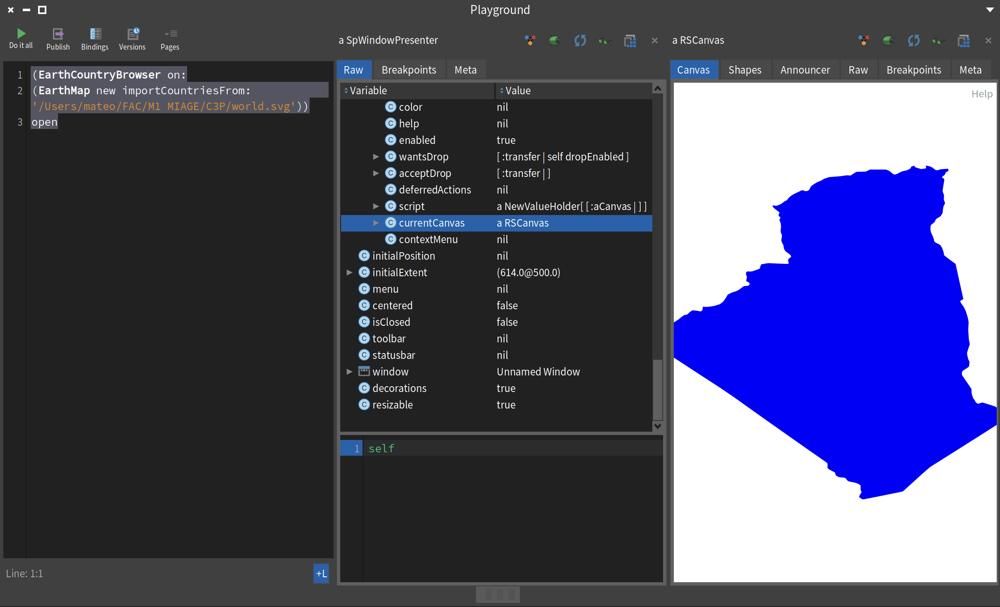
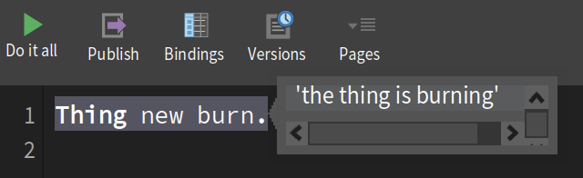
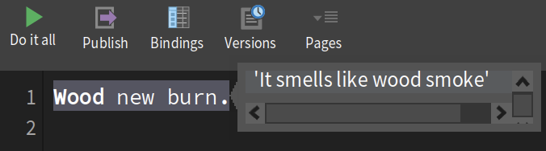
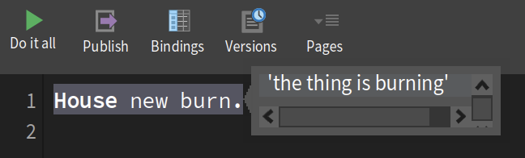
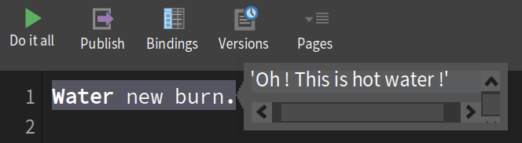
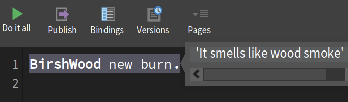
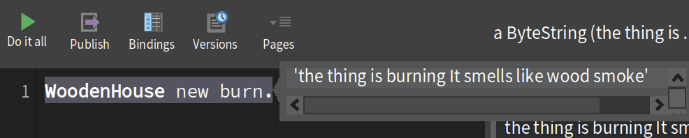

# Report Week 2

# Antonin DELOISON

First, I start by review all the videos about dispatch, super and self.

Next, I carried out a small project on animals, consisting of subclasses of animals and a parent class Animal that have a common method. The aim is to test different ways of reusing a method from the parent class. [Git](https://github.com/antonindeloison/PharoProjects/tree/main/Animals)

First example : Use self 

```
Animal >> parler
    ^ 'Je suis un animal.'.

Dog >> parler
    ^ 'Woof.'.

Animal >> crier
    ^ self parler , ' !!!'.
`````

```
Dog new crier.   "result: 'Woof. !!!'"
````

Here we can see that self works perfectly. The Dog class does not have a crier method, so it looks up the parent, finds the method and applies the target's parler method, in this case the parler method of Dog.

Second example : Use super

````
Animal >> parler
    ^ 'Je suis un animal.'.

Cat >> parler
	^ super parler , ' et je dis Miaou !'.
`````

````
Cat new parler.  "result: Je suis un animal. et je dis Miaou !"
`````

Here, the lookup method will start in the superclass, Animal. The content of the superclass method will be retrieved, returned to the receiver (Cat), then concatenated with the rest of the message.

During this example, I did not encounter any particular problems.

This example is popular, but it is very easy to understand and therefore allows you to focus on the concept being studied.

Before the next one, concerning Kata, I'm going to get ahead with reading the rest of the lessons, so I'm going to study reverse engineering and realize the flag project.

# Matéo DA COSTA

## Casting Spells with Code

During our last class, we started coding a domain-specific language (DSL) for rolling dice. It is used by players of games such as Dungeons & Dragons.

During this exercise, I improved my use of class attributes and accessors.
I also learned how to write functional expressions, such as this one in the `roll` method of the `handleDie`:

```
roll

	| sum |
	sum := 0.
	dice do: [ :each | sum := sum + each roll ].
	^ sum
```
To finish, I also learned how to extend a class within a single package using my `D:` method.

```
D: anInteger

	| hd1 |
	hd1 := DieHandle new.
	self timesRepeat: [ hd1 addDie: (Die withFaces: anInteger) ].
	^ hd1
```

## They'll call me freedom just like a wavin' flag

I did the flag exercise to learn how to use presenters. The tutorial was really easy to follow. I managed to implement the few required methods, such as:
- `printOn:` by adding the country code
```
printOn: aStream

	super printOn: aStream.
	aStream nextPutAll: ' ' , name , ' (' , code asString , ')'
```
- `importCountryFromXMLNode:` by adding a new **EarthMapCountry**
```
importCountryFromXMLNode: aXMLElement

	countries add: (EarthMapCountry new fromXML: aXMLElement)
```
- `showFlag:` by updating the image by using the country code
```
showFlag: aString

	countryFlag image: (self flagForCountryCode: aString)
```
However, I did succeed in showing the shape of the country with the Roassal class. I updated the class declaration with the #countryRoassal attribute, the `initializePresenters` method, and the `defaultLayout`. I also created two additional classes, such as:
- `canvasForPath:`
```
canvasForPath: aPath

	| canvas svg |
	canvas := RSCanvas new.

	svg := RSSVGPath new
		       color: Color blue;
		       svgPath: aPath;
		       yourself.

	canvas add: svg.

	^ canvas @ RSCanvasController
```
- `showRoassal:`
```
showRoassal: aPath

	countryRoassal canvas: (self canvasForPath: aPath)
```
But the canvas is never updated, even though it is present in the current canvas attribute of the presenter when I execute the presentation.
  
I don't understand the issue and I will ask the question for the next class.

## Essence of dispatch

### As I understood it
The dispatch can be summarized in two principles:
1. Let the receiver decide
2. Do not ask, tell

This allows us to avoid using if cases by letting the class decide which case we are in and which procedure to execute.

For me, it is similar to overloading methods in Java, but without the need for parameters.

**Source:** [Pharo MOOC: Essence of Dispatch](https://rmod-pharo-mooc.lille.inria.fr/MOOC/PharoMOOC-Videos/FR/Week3/C019SD-W3-S2-v3.mp4)  


### Pyromaniac Rising
To practice this pattern and challenge my understanding, I thought about the example of the message “burn” being sent to different objects.

So, to begin, I created a **Thing** class with a `burn` method:
```
Object << #Thing
	slots: {};
	package: 'MyDispatch'

burn

	^ 'the thing is burning'
```
  

Then I created **Wood**, **House**, and **Water**. They are all things, but they burn differently:

```
Thing << #Wood
	slots: {};
	package: 'MyDispatch'
burn

	^ 'It smells like wood smoke'
```
  
```
Thing << #House
	slots: {};
	package: 'MyDispatch'
brun

	^ 'Fire! Fire! The house is on fire!'

```
  
```
Thing << #Water
	slots: {};
	package: 'MyDispatch'
burn

	^ 'Oh ! This is hot water !'
```
  

Furthermore, we could imagine that all types of wood burn in the same way. So, for the implementation of a **BirchWood** class, it only needs to inherit from **Wood**:
```
Wood << #BirshWood
	slots: {};
	package: 'MyDispatch'
```
  

As a last element, how do we make a wooden house burn? It is both like wood and like a house, but a class can’t inherit from two classes at the same time. So, the **WoodenHouse** class can inherit from **House** and use **Wood** as an attribute. It inherits from House because a wooden house is considered more of a house than just wood.

```
House << #WoodenHouse
	slots: { #wood };
	package: 'MyDispatch'

initialize

	super initialize.
	wood := Wood new

wood: aWood

	wood := aWood

burn

	^ super burn , ' ' , wood burn
```

  

Here, I don’t understand why the `burn` method from **Thing** is called. It should be the `burn` method from **House**, since **WoodenHouse** directly inherits from **House**.
