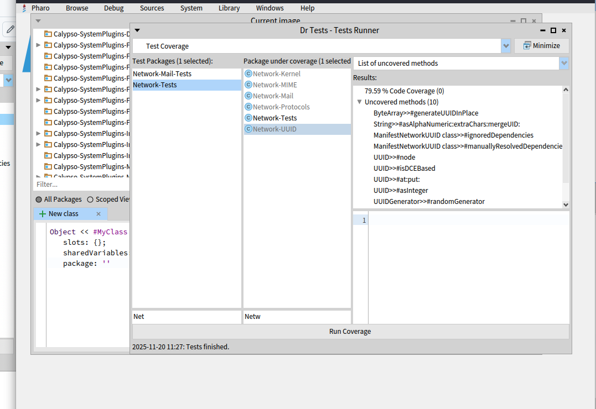
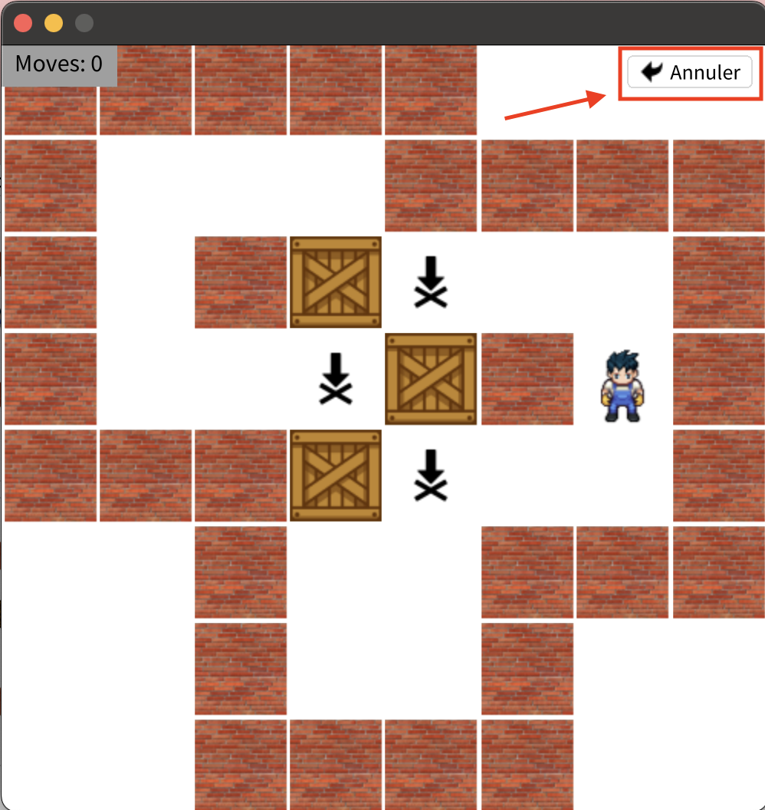

## Gautam Demeulemeester

Cette semaine j'ai effectué l'exercice Mutation Testing.

J’ai commencé par mesurer la couverture de tests de la bibliothèque Network-UUID à l’aide de DrTest.
J’ai constaté que la couverture était relativement élevée, mais ne suffisait pas à garantir une bonne qualité des tests.
Il faudrait ajouter d’autres tests pour augmenter la couverture.

J’ai ensuite lancé une analyse sur les classes UUID et UUIDGenerator.
Le mutation score obtenu était d’environ 37%, en ajoutant UUIDTest, puis UUIDGeneratorTest, le score a augmenté clairement.

J’ai ensuite lancé Mutalk sur la librairie Artefact. J'ai remarqué que la sélection aléatoire de mutants donne des résultats utilisables beaucoup plus rapidement.

Cette semaine j'ai également avancé un peu sur notre projet Sokoban (beaucoup d'exploration de code) et lu le module 9 "Module 9: About Inversion of control / Registration
".

## HEDDI Abdelkader

Cette semaine, j'ai entamé la phase de développement de la fonctionnalité "Undo" pour le projet Sokoban. J'ai trouvé cette fonctionalité importante pour l'expérience utilisateur : elle permet au joueur de corriger une erreur de manipulation ou de stratégie sans avoir à redémarrer l'intégralité du niveau.

J'ai commencé par l'intégration de l'interface utilisateur en modifiant la classe MygSkBoardElement. D'un point de vue code, j'ai :

- Ajouté une variable d'instance undoButton pour référencer le composant graphique.
- Implémenté la méthode initializeUndoButton pour configurer un ToButton avec l'icône et le label appropriés.
- Utilisé des contraintes BlFrameLayout pour positionner le bouton précisément en haut à droite du plateau (alignRight, alignTop).
- Modifié la méthode principale board: pour assurer l'initialisation correcte du bouton et son ajout à la hiérarchie visuelle (addChild:), en m'assurant qu'il s'intègre bien avec les couches existantes (backgroundLayer, foregroundLayer).
- Vous pouvez voir le résultat de l'intégration visuelle dans la capture d'écran ci-dessous :

La prochaine étape sera d'implémenter la logique métier en utilisant le Pattern Command. Cela permettra d'encapsuler chaque mouvement dans un objet réversible. Je me concentrerai également sur l'écriture de tests unitaires pour garantir que l'historique des coups est géré correctement et que l'état du jeu reste cohérent après une annulation (tests au vert).

Je n'ai pas de questions pour cette semaine.
