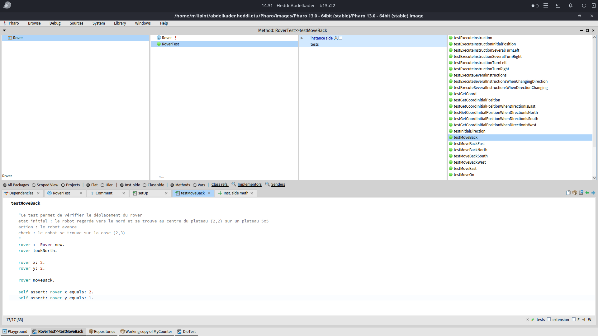

## Gautam Demeulemeester

La semaine dernière j'ai avancé sur la partie 2 du Rover en pair-programming en ajoutant la fonctionnalité de reculer. Nous avons aussi ajouter le fait de pouvoir renseigner les dimensions du plateaux. Tout cela était accompagné de tests que nous avons su faire passer.

Pour cette semaine je me suis intéréssé au design-patter Template Method que j'avais déja utilisé en Java. Template Method permet de redefinir des methodes d'une classe en utilisant l'héritage. On imagine une première classe :

```
Object << #AbstractClass
	slots: {};
	sharedVariables: {};
	package: 'TMExemple'

AbstractClass >> templateMethode
    self first.
    self second.
    self third.

AbstractClass >> first
    Transcript show: '1'; cr.

AbstractClass >> second
    self subclassResponsibility.

AbstractClass >> third
    Transcript show: '3'; cr.
```

Et une deuxième classe qui hérite de AbstractClass :

```
Object << #ConcreteClass
	slots: {};
	sharedVariables: {};
	package: 'TMExemple'

AbstractClass >> second
    Transcript show: '2'; cr.
```

Ainsi un appel à templateMethode fera :

```
ConcreteClass new templateMethode.

1
2
3
```

## HEDDI Abdelkader

Cette semaine, j’ai terminé sur l’exercice du Rover (pair programming) sur lequel j'avais grandement avancé la semaine dernière avec l'aide du professeur.

J’ai écrit 29 tests unitaires (voir l'image ci-dessous) pour couvrir les différents cas possibles (déplacements, rotations, hors du plateau ..). Cela m’a donné plus de confiance dans mon code et m’a aussi entraîné à suivre une vraie démarche TDD en incluant le **mutation testing** pour vérifier la robustesse de mes tests.



J'ai aussi refait l'interro et notament l'exercice 2 avec les méthodes git (en travaillant sur les cas qui me paraissaient compliqué durant l'éval).

Pour terminé j'ai fais un exercice pour pratique le DP template method qui m'a permis de comprendre à factoriser du code commun et déléguer au sous-classes les parties variables.

Je n'ai pas de questions pour cette semaine.
